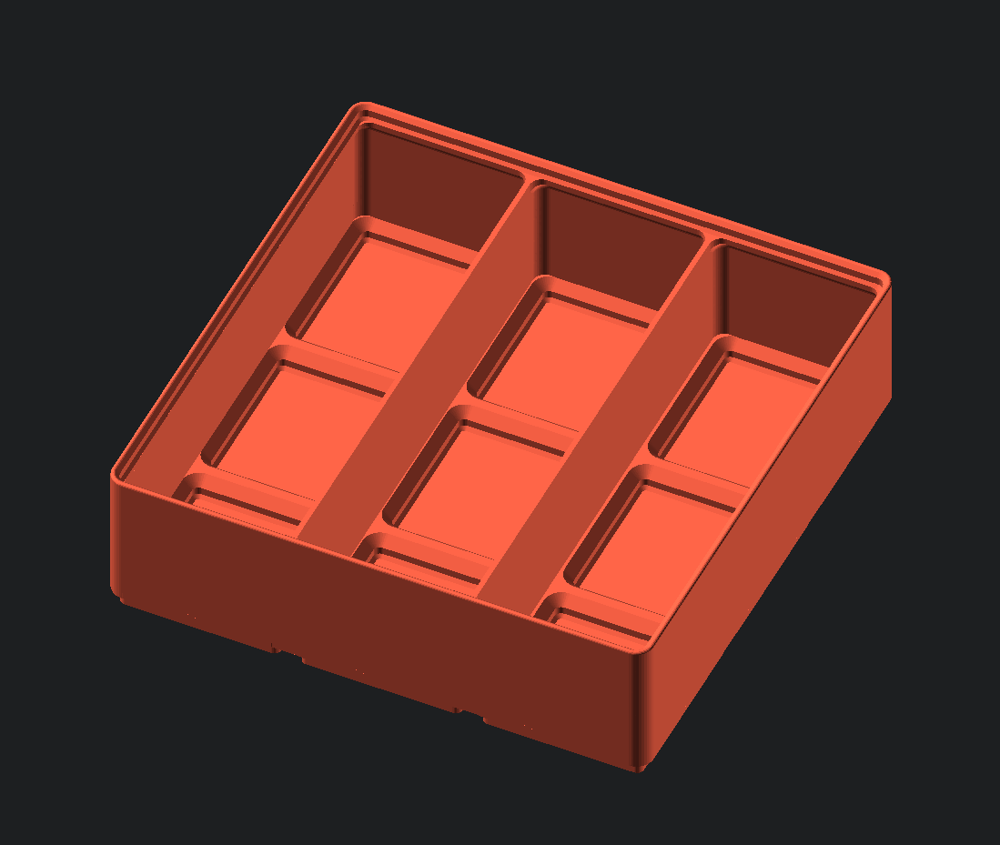

# gridfinity-rebuilt-lite

Generates stock bins, but with a twist: the bases are hollow. This is unable to be implemented directly into `gridfinity-rebuilt-bins` due to its surprisingly complex construction. It couldn't be a toggle without causing the structure of the script to fundamentally change (and become more complex) so it was moved to a separate file. Notably, there are some parameters missing, as they are incompatible with the lite variation. Additionally, the complex geometry means rendering is fairly slow, and currently causes many CSG errors.



## Script Parameters

Parameter | Range | Description
--- | ----- | ---
gridx | { n>0 \| n∈R } | number of bases along the x-axis
gridy | { n>0 \| n∈R } | number of bases along the y-axis
gridz | { n>0 \| n∈R } | bin height. See bin height information and "gridz_define" below.
length | { n>0 \| n∈R } | length of one unit of the base. <br> default: 42 (The Answer to the Ultimate Question of Life, <br>the Universe, and Everything.)
divx | { n>0 \| n∈Z }  | number of compartments along X
divy | { n>0 \| n∈Z }  | number of compartments along Y
enable_zsnap | boolean | automatically snap the bin size to the nearest 7mm increment. <br> default: true
style_lip | {0, 1, 2} | if you are not stacking the bin, you can disable the top lip <br> to save space. <br>     • (0) Regular lip <br>     • (1) Subtract lip to save space <br>     • (2) Disable lip while retaining height
gridz_define | { n>0 \| n∈R } | determine what the variable "gridz" applies to based on <br> your use case. default: 0. <br>     • (0) gridz is the height in # of 7mm increments (Zack) <br>     • (1) gridz is the internal height in millimeters <br>     • (2) gridz is the overall external height of the bin in millimeters
style_tab | { 0, 1, 2, 3, 4, 5 } | how the tabs for labels are generated. <br>     • (0) Full tabs across the entire compartment <br>     • (1) automatic tabs <br>     - left aligned tabs on the left edge<br>     - right aligned tabs on right edge<br>     -  center tabs otherwise <br>     • (2) left aligned tabs <br>     • (3) center aligned tabs <br>     • (4) right aligned tabs <br>     • (5) no tabs
style_hole | { 0, 1, 2, 3 } | the style of holes in the bases <br>     • (0) No holes <br>     • (1) Magnet holes only <br>     • (2) Magnet and screw holes - no printable slit <br>     • (3) Magnet and screw holes - with printable slit
div_base_x | { n>=0 \| n∈Z } | number of divisions per 1 unit of base along the X axis. <br>(default 1, only use integers. <br>0 means automatically guess the division)
div_base_y | { n>=0 \| n∈Z } | number of divisions per 1 unit of base along the Y axis. <br>(default 1, only use integers. <br>0 means automatically guess the division)

<br>

## Modules

---

### gridfinityLite

Wrapper function that calls [`gridfinityInit`](bins.md#gridfinityInit) and [`gridfinityBase`](bins.md#gridfinityBase) functions (hence the sheer quantity of parameters). Like [`gridfinityInit`](bins.md#gridfinityInit), it uses its children as cutters for the compartments.

**`gridfinityLite(gridx, gridy, gridz, gridz_define, enable_lip, enable_zsnap, length, div_base_x, div_base_y, style_hole)`**

Parameter | Range | Description
--- | ----- | ---
gridx | { n>0 \| n∈R } | number of bases along the x-axis
gridy | { n>0 \| n∈R } | number of bases along the y-axis
gridz | { n>0 \| n∈R } | bin height. See bin height information and "gridz_define" below.
gridz_define | { n>0 \| n∈R } | determine what the variable "gridz" applies to based on <br> your use case. default: 0. <br>     • (0) gridz is the height in # of 7mm increments (Zack) <br>     • (1) gridz is the internal height in millimeters <br>     • (2) gridz is the overall external height of the bin in millimeters
style_lip | {0, 1, 2} | if you are not stacking the bin, you can disable the top lip <br> to save space. <br>     • (0) Regular lip <br>     • (1) Subtract lip to save space <br>     • (2) Disable lip while retaining height
enable_zsnap | boolean | automatically snap the bin size to the nearest 7mm increment. <br> default: true
length | { n>0 \| n∈R } | length of one unit of the base. <br> default: 42 (The Answer to the Ultimate Question of Life, <br>the Universe, and Everything.)
div_base_x | { n>=0 \| n∈Z } | number of divisions per 1 unit of base along the X axis. <br>(default 1, only use integers. <br>0 means automatically guess the division)
div_base_y | { n>=0 \| n∈Z } | number of divisions per 1 unit of base along the Y axis. <br>(default 1, only use integers. <br>0 means automatically guess the division)
style_hole | { 0, 1, 2, 3 } | the style of holes in the bases <br>     • (0) No holes <br>     • (1) Magnet holes only <br>     • (2) Magnet and screw holes - no printable slit <br>     • (3) Magnet and screw holes - with printable slit

```
// Example: generate a 3x3x6 bin with 2x2 compartments, that is hollow
gridfinityLite(gridx=3, gridy=3, gridz=6, gridz_define=0, enable_lip=true, enable_zsnap=false, length=42, div_base_x=0, div_base_y=0, style_hole=1) {
    cutEqual(n_divx=2, n_divy=2, style_tab=1, enable_scoop = false);
}
```
